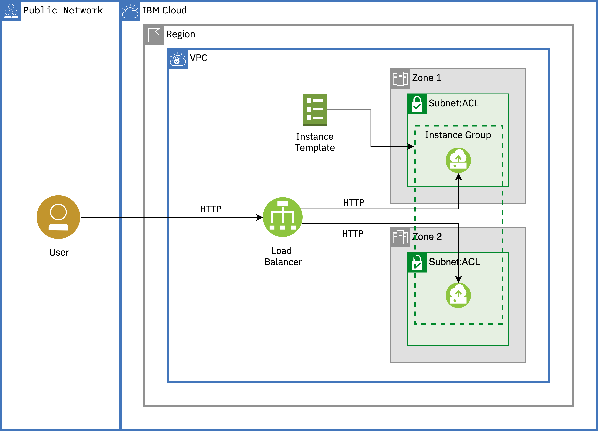

# Auto scale for VPC

Con Auto Scale for VPC puede crear un grupo de instancias para escalar según sus necesidades. En función de las métricas de utilización objetivo que defina, el grupo de instancias puede añadir o eliminar instancias de forma dinámica para lograr la disponibilidad de instancias especificada.

Siguiendo las instrucciones de esta guia se aprovisionaran los siguientes recursos

- VPC
- Subnets - una en cada zona (zone 1 and zone 2)
- VSIs - Dependiendo de la cantidad de carga de la aplicación
- Load balancer (backend pool and frontend listener)
- Instance group usando un instance template

### Pre-requisitos:

- SSH key - referencia [VPC SSH documentation](https://cloud.ibm.com/docs/vpc?topic=vpc-ssh-keys)
